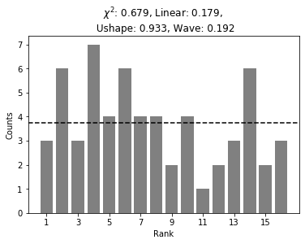
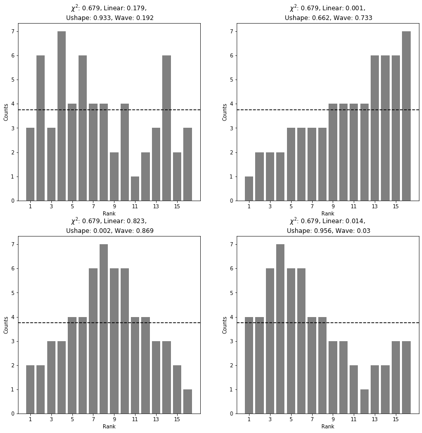

# testrankhist
Python package to perform statistical tests related to the deviation from flatness of a rank histogram. 

# Example
To begin, import testrankhist and matplotlib for plotting figure:
```python
from testrankhist import *
import matplotlib.pyplot as plt
```
Then, we define our histograms:
```python
>>> hist_slope  = [3, 6, 3, 7, 4, 6, 4, 4, 2, 4, 1, 2, 3, 6, 2, 3]
```
Then, create an TestRankHist object:
```python
>>> test_slope = TestRankHist(hist_slope)
```
So, you can access the chi-square results with:
```python
>>> test_slope.chisquare.statistic
12.0
>>> test_slope.chisquare.p_value
0.679
```
To access to the statistics and p-value of the linear test:
```python
>>> test_slope.linear.statistic
1.807
>>> test_slope.linear.p_value
0.179
```
Other tests available are `.Ushape` and `.wave`:
```python
>>> test_slope.Ushape.p_value
0.933
>>> test_slope.wave.p_value
0.192
```
If we want to plot the histogram with the results of the p-values:
```python
>>> test_slope.plot()
```
 <br>
In the case where we have several histograms and want to put them on the same figure:
```python
>>> hist_linear = [1, 2, 2, 2, 3, 3, 3, 3, 4, 4, 4, 4, 6, 6, 6, 7]
>>> test_linear = TestRankHist(hist_linear)
>>> hist_convex = [2, 2, 3, 3, 4, 4, 6, 7, 6, 6, 4, 4, 3, 3, 2, 1]
>>> test_convex = TestRankHist(hist_convex)
>>> hist_wave   = [4, 4, 6, 7, 6, 6, 4, 4, 3, 3, 2, 1, 2, 2, 3, 3]
>>> test_wave = TestRankHist(hist_wave)
```
```python
>>> fig, axs = plt.subplots(2, 2)
>>> test_slope.plot(ax=axs[0, 0])
>>> test_linear.plot(ax=axs[0, 1])
>>> test_convex.plot(ax=axs[1, 0])
>>> test_wave.plot(ax=axs[1, 1])
```
<br>

# References
Jolliffe I.T., Primo C. (2008): Evaluating rank histograms using decompositions of the chi-square test statistic. Mon. Wea. Rev. 136(6) 10.1175/2007MWR2219.1 <br>
Michaël Zamo, Liliane Bel, & Olivier Mestre. (2020). Sequential Aggregation of Probabilistic Forecasts – Applicaton to Wind Speed Ensemble Forecasts. 
